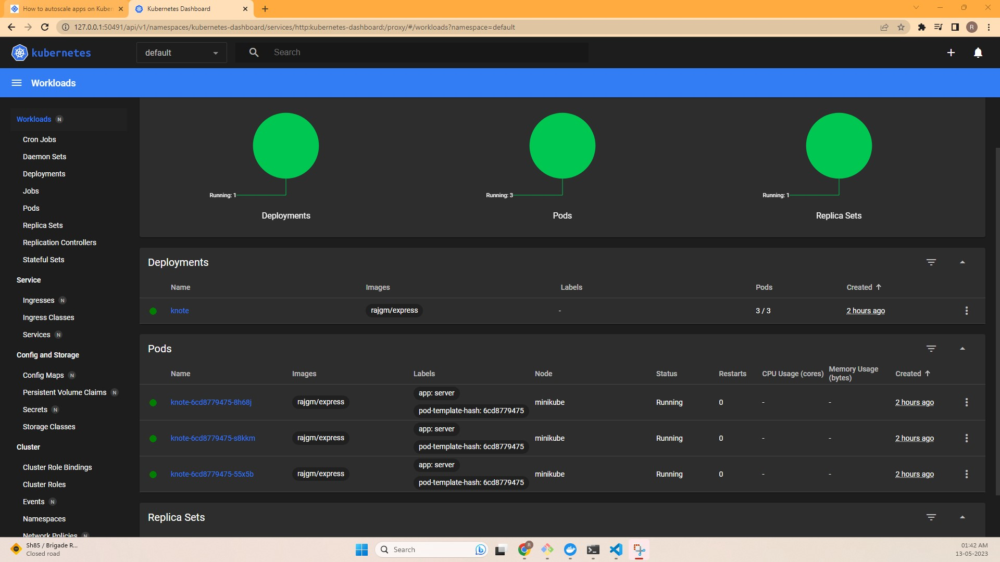
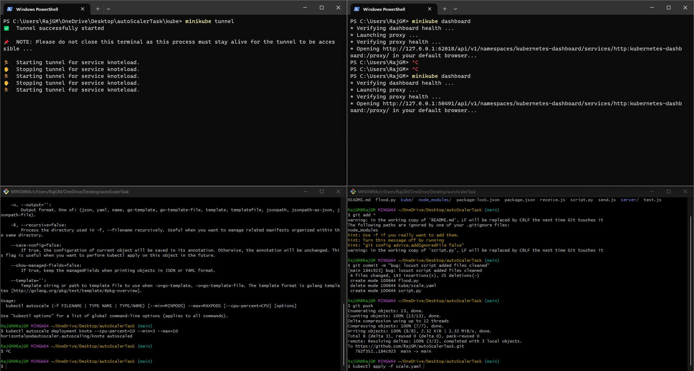
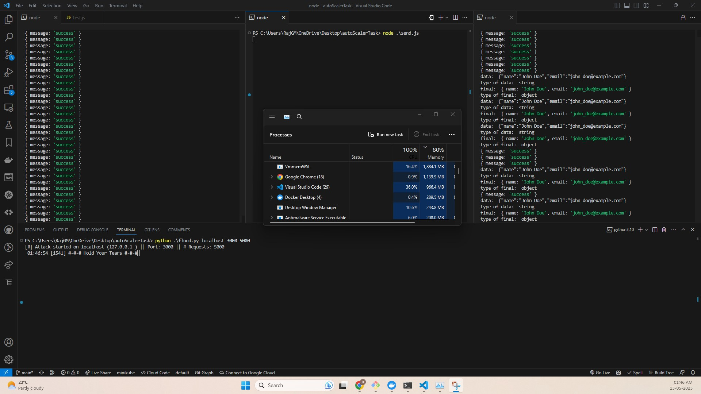

# autoScalerTask

### kubectl apply -f new.yaml
### kubectl apply -f knote.yaml

### minikube tunnel

### minikube dashboard

### kubectl autoscale deployment knote --cpu-percent=10 --min=3 --max=10

### 

